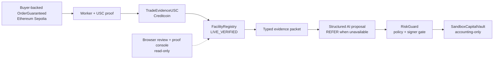

# LoomCredit

Verified trade evidence. Bounded AI. Testnet underwriting controls.

LoomCredit is a Creditcoin USC prototype for turning a proof-backed trade event into a bounded underwriting action. The product boundary is deliberately narrow:

1. A source-chain lifecycle event (`OrderGuaranteed`, cancellation, dispute, or settlement) is verified and decoded by the USC contract boundary.
2. The evidence registry binds the event to order terms, identity commitments, and a replay-safe query key.
3. A structured agent proposes a schema-bound facility quote, or returns `REFER` when evidence/model inputs are unavailable.
4. RiskGuard validates the signed quote before the accounting-only sandbox vault records a reservation.

The adversarial policy lab is local and deterministic. The separate read-only
worker feed and live proof route show only recorded testnet evidence; neither
the browser nor the local lab submits a transaction or calls a model.

## Current status

Verified in this checkout:

- Source escrow lifecycle contracts compile and pass the Foundry suite,
  including partial- and zero-settlement refund coverage and non-zero identity
  commitment validation.
- Creditcoin-side registry, proof boundary, RiskGuard, and sandbox vault compile
  and pass the Foundry suite, including source-lifecycle parity and full
  cancellation/dispute/settlement payload binding.
- The agent passes schema, evidence-binding, model-unavailable, safe-policy, and unsafe-policy tests.
- The worker compiles with the official USC SDK, persists event stages and a source block cursor in SQLite, and has bounded source-event discovery with confirmation depth.
- The web app passes ESLint, TypeScript, and a production Next.js build.
- The operator workspace resolves a recorded case, opens its proof packet, and
  fails closed with `EVIDENCE_NOT_FOUND` for unknown references.
- The local policy API returns a request-scoped decision trace with a UUID,
  timestamp, measured evaluation time, input hash, schema version, and explicit
  `LOCAL_FIXTURE_ONLY` origin; the UI exposes the same trace for inspection.
- Documentation search indexes page content and code examples, so integration
  terms such as `nonce` resolve to the relevant API page.
- The selected brand/architecture visuals are available under [`web/public/assets`](web/public/assets). The parent reference pack is intentionally not vendored into this repository.

## Judge-facing capture set

These are real screenshots captured from the running application. They are
judge-facing product glimpses, not transaction proof. The recorded proof image
is a visual rendering of the evidence manifest; explorer links remain the
authoritative receipts.

- [Product home](docs/screenshots/loomcredit-home.png) — first-impression user flow and recorded order context.
- [Case review workspace](docs/screenshots/loomcredit-review-workspace.png) — the real source intake first, with the recorded-case reference and fail-closed boundary below it.
- [Policy lab](docs/screenshots/loomcredit-policy-lab.png) — local policy boundary with the live-evidence handoff visible.
- [Rejected quote](docs/screenshots/loomcredit-policy-rejected.png) — 80% proposal stopped by the deterministic advance cap, with `LOCAL_FIXTURE_ONLY` visible.
- [Proof console](docs/screenshots/loomcredit-proof-console.png) — recorded `LIVE_VERIFIED` source-to-USC evidence with the recorded RiskGuard approval boundary explicit.

The proof console screenshot represents the recorded testnet evidence bundle;
the public deployment, video, and submission states remain intentionally
visible rather than implied away.

## How an operator uses LoomCredit

The primary product path is **Review a case**, not the local policy lab:

1. Open [`/review`](http://localhost:3000/review), connect the operator wallet,
   and sign in with the server-issued message. The recorded reference below the
   intake form is read-only; it helps orient a new operator without pretending
   to create a case.
2. Enter a source transaction plus the requested advance and delivery tenor,
   then submit the case. The authenticated account can return to the [`case
inbox`](http://localhost:3000/cases) at any time; search and workflow filters
   surface cases that need evidence recovery, a proposal, or human review.
3. Open the case detail page. It is the operational center: source-receipt
   facts (buyer, supplier, order value, guarantee, due date, chain, and nonce)
   are visibly separate from the operator's requested terms and current policy
   ceiling.
4. Watch the worker move from receipt inspection through Attestcoin/USC proof
   and Creditcoin registry read-back. Inspect the linked receipts, evidence ID,
   persisted lifecycle history, and any retry or fail-closed state.
5. Only after the current evidence is `LIVE_VERIFIED` can the operator request
   a bounded proposal. The case shows the provider/model boundary, structured
   reason codes, deterministic RiskGuard checks, requested-versus-quoted terms,
   and the final `APPROVED`, `REJECTED`, or `REFER` result. The browser does not
   call a model, sign a quote, submit a transaction, or approve a loan.
6. Record an append-only operator outcome: accept the recommendation, request
   more information, or decline the case review. Acceptance requires a fresh
   actionable worker read-back and a policy-approved proposal. It remains an
   internal review record—not a RiskGuard signature, capital reservation, or
   loan approval.
7. Use [`/demo`](http://localhost:3000/demo) only to pressure-test deterministic
   policy controls. It is deliberately labelled `LOCAL_FIXTURE_ONLY` and is
   not an alternate product workflow.

The demo result includes a raw trace JSON view for the request ID, policy
timestamp, local evaluation time, canonical input hash, schema version, and
fixture boundary. This is observability for a deterministic local scenario, not
model, wallet, proof-builder, or blockchain evidence.

Unknown references stop with `EVIDENCE_NOT_FOUND`. User-entered fields never
become live evidence or a fabricated quote. In a production integration, the
next step would be a trusted marketplace or source-chain connector that creates
the worker evidence row.

Verified testnet artifacts in this checkout:

- Sepolia `MockUSDC` and `OrderGuaranteeEscrow` deployments with mined
  receipts.
- A successful `OrderGuaranteed` transaction at block `11443299`, with the
  decoded order fields committed in [`source-order.json`](docs/deployments/source-order.json).
- A successful proof-builder response for that source block. This is proof
  generation step before native verification.
- A funded CC3 deployment with post-deployment wiring checks in
  [`creditcoin-deployment.json`](docs/deployments/creditcoin-deployment.json).
- A successful native USC verification receipt, `evidenceId`, independent
  `FacilityRegistry` read-back, and live RiskGuard approval receipt in
  [`demo-evidence.md`](docs/demo-evidence.md).
- The source and CC3 contracts now project every source terminal outcome that
  the escrow permits: `EvidenceVerified`, `Quoted`, `Reserved`, `Disputed`,
  `Cancelled`, and `Settled`. The current deployed addresses predate this
  correction and must be redeployed before claiming the corrected lifecycle as
  live.

Still blocked by external setup:

- Prototype video/whitepaper publication and human-owned submission fields.
- The hosted Render revision is older than this local correction set and must
  be rebuilt and redeployed before the hosted UI can be described as current.
- The deployed bytecode predates the current lifecycle correction and
  `QuoteDecisionAudited`; the evidence records the backwards-compatible
  `QuoteApproved` receipt without claiming newer source behavior as deployed.

Those are external setup boundaries, not simulated results.

## Optional product analytics

The browser includes a small PostHog event contract for product feedback, not
underwriting or chain truth. It is disabled by default and only initializes when
the operator configures a project token and a visitor explicitly opts in. The
integration uses custom allow-listed events with no automatic pageviews,
autocapture, session replay, person profiles, browser persistence, wallet
addresses, order IDs, evidence IDs, raw inputs, or provider payloads. See
[`docs/Analytics_Contract.md`](docs/Analytics_Contract.md) for the event
dictionary and the analyses that may be created after the first real events.

## Hackathon fit

LoomCredit is prepared primarily for the **AI** track, with a concrete RWA and
DeFi financing use case: pre-invoice, buyer-backed supplier finance. The AI is
not a chat surface or a decorative classifier. It turns a typed,
cryptographically verified trade packet into a bounded facility proposal; the
agent signer and RiskGuard policy keep authorization outside the model. RWA
and DeFi explain the real-world obligation and accounting action that make the
AI useful. Attestcoin is the source-of-truth boundary, not an optional data
feed.

The [official BUIDL CTC page](https://buidl.creditcoin.org/) currently lists
AI, RWA, DeFi, DePIN, and Gaming tracks. Track labels, deadlines, eligibility,
and submission fields remain organizer-owned facts and must be re-verified from
the live submission form before any external action:

```text
Sepolia OrderGuaranteed
  -> Attestcoin proof builder
  -> native USC verifier on Creditcoin
  -> evidence-bound model quote
  -> signed RiskGuard policy check
  -> accounting-only sandbox reservation
```



The model never receives a private key and never authorizes capital. The
contract verifies the source event, while `RiskGuard` enforces the signer,
evidence, lifecycle, exposure, expiry, and liquidity rules.

The recorded demo order is already `SANDBOX_RESERVED` (the raw contract state is
`RESERVED`) as accounting-only testnet state; `NO_CAPITAL_MOVED` is the product
boundary.
To produce a fresh model quote, register a new source event and wait for its
facility to reach `EVIDENCE_VERIFIED`; the quote and contract paths reject
reusing the recorded order.

The shortest truthful judge walkthrough is in [`docs/demo-runbook.md`](docs/demo-runbook.md).
The first-user hypothesis and non-goals are documented in
[`docs/customer-workflow.md`](docs/customer-workflow.md).

There is no token in the current prototype. Tokenomics would add governance,
custody, and regulatory questions without solving the evidence-review problem;
the current value is the verifiable evidence rail and the visible policy stop.
Fees, bonded proof providers, or operator credentials are possible future
network primitives only after a real operator bottleneck and legal model are
validated.

## Creditcoin ecosystem alignment

LoomCredit is an AI-primary underwriting prototype with an RWA/DeFi
supplier-finance use case. It uses Creditcoin's Attestcoin/USC pattern as the
evidence rail: deploy source logic, prove the source event, verify it in a
Creditcoin contract, and execute only after deterministic policy checks. This
is aligned with the public Creditcoin builder materials; it is not a claim of
sponsorship, listing, partnership, or CEIP/PenguinBase eligibility.

- [Attestcoin builder overview](https://creditcoin.org/Deploy) — protocol flow,
  testnet starting point, and supported application categories.
- [Creditcoin BUIDL CTC announcement](https://creditcoin.org/blog/buidl-ctc-hackathon/)
  — public track and ecosystem context.
- [BUIDL CTC official page](https://buidl.creditcoin.org/) — current event and
  track context.
- [DoraHacks BUIDL CTC submission page](https://dorahacks.io/hackathon/buidl-ctc/detail)
  — organizer-owned submission fields remain authoritative.
- [CEIP and ecosystem launch paths](https://creditcoin.org/Launch) — possible
  post-qualification distribution and funding routes, not guaranteed outcomes.

## Live run after CC3 funding

The repository contains a real Sepolia escrow deployment, a real
`OrderGuaranteed` receipt, a successful proof-builder response, a funded CC3
deployment, a successful native USC verification receipt, and a recorded
Groq-backed signed quote accepted by the deployed RiskGuard. The agent still
requires an OpenAI-compatible model configuration and a separate agent signer
when producing a fresh quote. The verified sequence is:

```bash
corepack pnpm deploy:creditcoin
corepack pnpm worker:watch-once
corepack pnpm build:evidence-packet --packet-only > /tmp/loomcredit-evidence.json
corepack pnpm evidence:manifest
corepack pnpm --filter @loomcredit/agent quote /tmp/loomcredit-evidence.json --sign > /tmp/loomcredit-signed-quote.json
corepack pnpm evidence:manifest --agent-quote /tmp/loomcredit-signed-quote.json
corepack pnpm submit:quote /tmp/loomcredit-signed-quote.json --dry-run
corepack pnpm submit:quote /tmp/loomcredit-signed-quote.json

# After the live command returns its JSON receipt:
corepack pnpm evidence:manifest \
  --agent-quote /tmp/loomcredit-signed-quote.json \
  --riskguard-receipt /tmp/loomcredit-riskguard-receipt.json
```

The packet builder refuses to emit model input until the worker row is
`VERIFIED` and the evidence ID matches independent `FacilityRegistry` state.
`evidence:manifest --agent-quote` then binds a real agent CLI artifact to that
same packet and records only its reduced summary; it never broadcasts. The
signing and submission commands refuse non-live evidence. See
[`docs/live-deployment.md`](docs/live-deployment.md) and
[`docs/ai-underwriting-boundary.md`](docs/ai-underwriting-boundary.md) for the
credential boundary.

## Run it locally

Requirements: Node.js 22 or newer, Corepack, pnpm 11, and Foundry for contract tests.

```bash
corepack pnpm install
corepack pnpm dev
```

The local development command starts both the web console and its read-only
worker status feed. The status process uses `worker/data/worker.db` by default
so the live evidence panel reads the same checkout-local record as the worker
tools. Stop both processes with `Ctrl+C`.

Open `http://localhost:3000` and use:

- `/` — product overview and architecture
- `/review` — authenticated source transaction intake and live worker status, with a read-only recorded reference
- `/demo` — safe, unsafe, cancelled, and custom-input local policy scenarios
- `/orders/0x2a3f897f0f2a4daae050a72cac472a0afbb20d041f69d83de72ff0ba825043f1` — recorded testnet order packet
- `/orders/0x2424242424242424242424242424242424242424242424242424242424242424` — explicit local fixture order packet
- `/proof/0xe1e1e1e1e1e1e1e1e1e1e1e1e1e1e1e1e1e1e1e1e1e1e1e1e1e1e1e1e1e1e1` — local proof console
- `/proof/0xfed7def6e6d23052735cd35d968d9bca6895077d3a223e418a7c1530575320d9` — live CC3 evidence console
- `/security` — enforced controls and known limits
- `/access` — server-verified wallet sign-in and the authorization boundary
- `/whitepaper` — product thesis and implementation status
- `/whitepaper.pdf` — printable A4 whitepaper, explicitly marked as a testnet prototype
- `/legal` — legal center and prototype publication status
- `/privacy`, `/terms`, `/cookies` — current data, use, and browser-storage notices

The developer documentation is available at [`/docs`](http://localhost:3000/docs). It covers the evidence model, underwriting boundary, HTTP API, worker operations, CLI commands, security limits, and troubleshooting. The public site also exposes [`/llms.txt`](http://localhost:3000/llms.txt), a concise agent-readable map of canonical pages and evidence boundaries. It is an emerging convention, not a guarantee that every model or crawler will consume it.

The machine-readable public API contract is available at
[`/openapi.json`](http://localhost:3000/openapi.json). It describes the
read-only evidence feed, deterministic local fixture endpoint, bounded health
route, and wallet authentication flow; it does not represent a lending or
capital-movement API.

Hosted deployments can use `/api/health` for web liveness and `/api/ready` for
readiness of the configured worker evidence dependency. Local development is
intentionally not ready until `LIVE_EVIDENCE_API_URL` is configured.

Public JSON POST routes reject oversized request bodies. A multi-instance public
deployment still needs trusted edge rate limiting for authentication and other
high-volume routes; the SQLite auth store is not a distributed limiter.

Founder strategy and submission working notes are intentionally kept outside
the public product documentation. Repository-specific agent guidance is in
[`AGENTS.md`](AGENTS.md); local-only founder material belongs under the ignored
`private/founder/` directory.

The browser demo labels its boundary as `LOCAL_FIXTURE_ONLY`. The local packet uses deterministic test values and does not represent an on-chain facility.

The header exposes a real wallet access entry point through an injected EIP-1193 provider. After connection, `Sign in with wallet` obtains a one-time server nonce, asks the wallet to sign a human-readable EIP-191 message, verifies the recovered address on the server, binds it to an account and server-controlled role, and creates an expiring HttpOnly session. Authentication events are persisted in the server audit log; no transaction or private key is requested. See [`docs/whitepaper.md`](docs/whitepaper.md) and `/access` for the implementation-aligned boundary.

`AUTH_CHAIN_ID` controls the network accepted for wallet authentication; it is
separate from the Sepolia source chain and the Creditcoin CC3 execution chain.
The current hosted demo is configured for Ethereum Sepolia (`11155111`), so a
wallet connected to Creditcoin CC3 (`102031`) must switch networks before
signing in. If the deployment should authenticate CC3 wallets instead, set
`AUTH_CHAIN_ID=102031` in the hosted environment and redeploy. The nonce route
rejects an unsupported chain before consuming the sign-in rate-limit window.

For local development, the auth store defaults to `web/data/auth.sqlite` and is
ignored by Git. Set `AUTH_DATABASE_PATH` to durable shared storage before
running more than one web instance; set `AUTH_OPERATOR_ADDRESSES` only on the
server to grant the `operator` role. In a hosted deployment, set `AUTH_ORIGIN`
to the exact HTTPS web origin (and keep it aligned with
`NEXT_PUBLIC_SITE_URL`) so authentication does not depend on forwarded headers.

For a crawlable public release, set `NEXT_PUBLIC_SITE_URL` to the deployed HTTPS
origin. The app intentionally emits `noindex` and an empty sitemap while that
value points to localhost; this prevents staging or local pages from being
published accidentally. The public sitemap includes the documentation pages
and recorded testnet proof routes, while local fixtures, API routes, and wallet
access are excluded. Legal pages are indexable only after the same public-origin
gate, but their owner fields also require `LEGAL_ENTITY_NAME`,
`LEGAL_CONTACT_EMAIL`, `LEGAL_ENTITY_ADDRESS`, `LEGAL_GOVERNING_LAW`, and a
valid `LEGAL_EFFECTIVE_DATE`. See [`docs/legal-readiness.md`](docs/legal-readiness.md)
for the remaining counsel, retention, vendor, regulatory, and deployment gates.

The legal pages are a substantive prototype baseline, not legal advice or a
compliance certification. The repository is released under the MIT License in
[`LICENSE`](LICENSE), which does not grant lending, custody, regulatory, or data
processing rights described elsewhere in this document. The project does not
onboard customer documents or payments, and does not establish that a
future lending product is authorized in any jurisdiction. Do not publish the
pages as final until the operator identity, target markets, data inventory,
retention schedule, vendor terms, complaint route, and counsel review are
complete.

## Verification commands

Run the same gates used by CI:

```bash
corepack pnpm typecheck
corepack pnpm test
corepack pnpm lint
corepack pnpm build
corepack pnpm test:contracts
corepack pnpm format:check
corepack pnpm secret-scan
corepack pnpm public-boundary:check
corepack pnpm submit-quote:test
corepack pnpm agent-evidence:test
corepack pnpm evidence:manifest
corepack pnpm submission:preflight
# Agent/CI-friendly JSON (stdout stays parseable even when gates are blocked)
corepack pnpm --silent submission:preflight --json
# Optional local browser gate; CI runs this in a Playwright Chromium job.
python -m pip install playwright
python -m playwright install chromium
python scripts/browser-smoke.py
```

`submission:preflight` is intentionally non-zero until the external release
gates are satisfied. It reports missing CC3 receipts, model configuration,
public links, and media without printing secrets; it does not convert local
fixtures into live evidence.

The two CLI fixture paths are also useful for a quick judge-facing check. The
fixture policy can show that terms pass, but signing is deliberately not
requested in that boundary; it is not an authorization or a RiskGuard receipt:

```bash
corepack pnpm demo:happy
corepack pnpm demo:unsafe-agent

# Hostile quote mutation scenarios help the live-risk boundary video:
corepack pnpm demo:hostile-quote ./path/to/signed-quote.json all
```

The first returns an approved local policy evaluation. The second returns a rejected policy evaluation because the requested advance exceeds the deterministic cap.

## Live worker configuration

Copy `.env.example` to a local `.env` and provide real values out of band. Never commit the file or a private key.

```bash
set -a
source .env
set +a
corepack pnpm worker:config
corepack pnpm worker:process -- 0x<64-hex-source-transaction-hash>
# Or scan from WORKER_START_BLOCK with a durable SQLite cursor:
corepack pnpm worker:watch-once
corepack pnpm worker:watch
# In a separate long-lived process, expose sanitized evidence stages:
corepack pnpm worker:status
```

`worker:config` prints public endpoints and addresses only. The worker refuses to start when the source RPC, Creditcoin RPC, proof-builder URL, contract addresses, chain key, or wallet key is missing or malformed. The watcher also requires `WORKER_START_BLOCK`; it waits `WORKER_CONFIRMATIONS` blocks, scans at most 2,000 blocks per pass, records discovered events before processing, and retries unfinished rows after restart.

The live path is intentionally worker-only:

```text
source lifecycle event -> attestation wait -> USC proof request -> Creditcoin lifecycle verifier -> SQLite stage record
```

Network failures are stored as retryable failures. A successful guarantee result
is only reported after the Creditcoin receipt is successful and contains
`OrderEvidenceVerified`; lifecycle results require the matching
`LifecycleEvidenceVerified` event.

## Repository layout

```text
contracts/source/       Source-chain order escrow and lifecycle tests
contracts/creditcoin/   Facility registry, USC proof boundary, RiskGuard, vault
shared/                 Zod schemas, policy engine, deterministic fixture packet
agent/                  Model adapter, evidence binding, policy evaluation, signing
worker/                 Official USC proof-builder client, SQLite stages, submitter
web/                    Next.js app, local demo lab, proof/order/security/access routes
docs/                   Whitepaper, technical claims, threat model, architecture, verification, legal-readiness notes
CONTRIBUTING.md         Public contribution rules and verification checklist
SECURITY.md             Safe testing and vulnerability-reporting boundary
```

## Contract boundary

`TradeEvidenceUSC` consumes the current official USC proof shape: source chain key, block height, encoded transaction, Merkle root/siblings, and continuity proof. It verifies and emits through the native Creditcoin precompile interface, then checks:

- successful source receipt;
- the expected event topic at the requested log index;
- the configured escrow as emitter;
- exact order, buyer, supplier, token, amounts, deadline, terms, commitments, and nonce;
- a replay-safe query key.

`RiskGuard` is not an AI oracle. The agent can propose a quote, but the contract checks the EIP-712 signer, policy/model versions, expiry, nonce, evidence ID, facility state, advance and fee caps, guarantee ratio, tenor, buyer concentration against total sandbox capacity, and available sandbox liquidity before reserving. When verified cancellation, dispute, or settlement evidence closes a reserved facility, the registry releases both tracked exposure and its accounting-only vault reservation.

## Security and honesty boundary

- No user funds are held by the sandbox vault; it is accounting-only test liquidity.
- Missing evidence and unavailable model configuration become `REFER`.
- Unsafe policy proposals become `REJECTED`; the local demo exposes the failed check.
- No credentials are stored in the repository.
- The local order/proof routes and adversarial lab retain explicit
  `LOCAL_FIXTURE` and `not recorded` states; the live evidence route only uses
  the generated manifest and worker feed.
- The reference assets were used to shape the product and visual language, but the full parent `loomcredit-assets` directory is not copied into this repo.

## Official USC references

The live integration follows the current official examples and documentation checked while building this repository:

- [USC architecture overview](https://docs.creditcoin.org/usc/overview/usc-architecture-overview)
- [USC query proof and verification](https://docs.creditcoin.org/usc/creditcoin-oracle-subsystems/query-proof-and-verification)
- [USC migration guide](https://docs.creditcoin.org/usc/migration-guide)
- [Official USC testnet bridge examples](https://github.com/gluwa/usc-testnet-bridge-examples)
- [Official example package manifest](https://raw.githubusercontent.com/gluwa/usc-testnet-bridge-examples/main/package.json)

See [`docs/environment-verification.md`](docs/environment-verification.md) for the exact version and endpoint boundary used here.

## Disclaimer

Testnet prototype. No real lending, deposits, or investment product. The
recorded Sepolia-to-CC3 evidence and RiskGuard approval are testnet-only
accounting artifacts; production auth, regulated lending controls, and public
deployment remain separate gates.
