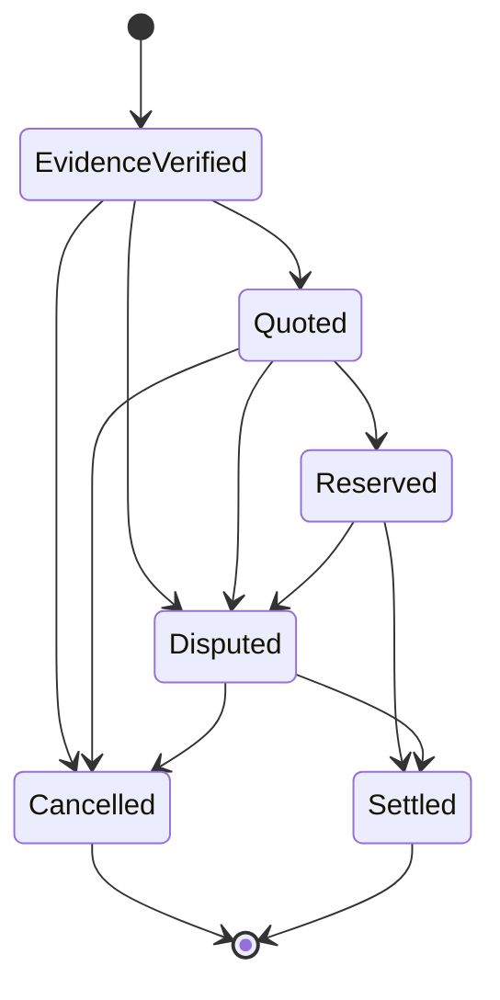

# LoomCredit Architecture and Contract Specification

## 1. Product boundary

LoomCredit is an **attested underwriting and facility-orchestration layer**, not a production lender.

The hackathon prototype demonstrates:

1. A buyer or marketplace posts a buyer-backed order guarantee on Ethereum Sepolia.
2. Attestcoin proves the source transaction to Creditcoin.
3. Creditcoin validates the exact commercial event and registers a unique order fingerprint.
4. An AI underwriting agent reads only verified evidence plus sandbox credit history.
5. The agent submits a structured quote.
6. A deterministic `RiskGuard` accepts or rejects the quote.
7. A sandbox capital vault reserves test liquidity.
8. Cancellation, dispute, and settlement proofs alter the facility lifecycle.

## 2. Non-goals

The MVP does not:

- originate real regulated loans;
- custody fiat or production stablecoins;
- claim legal enforceability of a purchase order;
- verify physical production or delivery;
- autonomously resolve commercial disputes;
- bridge assets back to Ethereum;
- support arbitrary source chains;
- train a statistically validated default model;
- globally prevent duplicate financing outside participating LoomCredit integrations.

## 3. High-level architecture

```mermaid
flowchart LR
    B[Buyer / Marketplace] -->|posts guarantee| E[OrderGuaranteeEscrow\nSepolia]
    E -->|Order lifecycle event| W[Proof Worker]
    W -->|wait for attestation + build proof| A[Attestcoin / Proof API]
    A -->|Merkle + continuity proof| U[TradeEvidenceUSC\nCreditcoin]
    U -->|verified TradeEvidence| F[FacilityRegistry]
    F -->|typed evidence| G[Underwriting Agent]
    G -->|EIP-712 quote + transaction| R[RiskGuard]
    R -->|approved reservation| V[SandboxCapitalVault]
    E -->|Cancelled / Disputed / Settled| W
    W --> U
    U --> F
```



## 4. Repository layout

```text
loomcredit/
├── contracts/
│   ├── source/                 # Foundry project: Sepolia contracts
│   │   ├── src/OrderGuaranteeEscrow.sol
│   │   ├── src/MockUSDC.sol
│   │   └── test/
│   └── creditcoin/             # Foundry project: CC3 contracts
│       ├── src/TradeEvidenceUSC.sol
│       ├── src/FacilityRegistry.sol
│       ├── src/RiskGuard.sol
│       ├── src/SandboxCapitalVault.sol
│       └── test/
├── worker/                     # TypeScript event/proof/submission worker
│   ├── src/cli.ts
│   ├── src/watcher.ts
│   ├── src/processor.ts
│   ├── src/proof.ts
│   ├── src/submit.ts
│   └── src/store.ts
├── agent/                      # TypeScript structured underwriting agent
│   ├── src/quote-cli.ts
│   ├── src/policy.ts
│   ├── src/model-adapter.ts
│   ├── src/quote.ts
│   └── src/signing.ts
├── web/                        # Next.js dashboard and proof console
│   ├── app/
│   ├── components/
│   └── lib/
├── shared/src/                 # Shared policy, schemas, and fixture boundary
│   ├── policy.ts
│   ├── schemas.ts
│   └── demo.ts
├── scripts/
│   ├── deploy-source.mjs
│   ├── deploy-creditcoin.mjs
│   ├── build-evidence-packet.mjs
│   ├── build-demo-evidence.mjs
│   └── submission-preflight.mjs
├── docs/
│   ├── Architecture_and_Contract_Spec.md
│   ├── Threat_Model_and_Test_Plan.md
│   ├── live-deployment.md
│   └── demo-evidence.md
└── README.md
```

## 5. Source-chain contract

### 5.1 `OrderGuaranteeEscrow.sol`

Purpose: capture a buyer-backed economic commitment and emit a purpose-built event that contains every value needed by Creditcoin logic.

### State

```solidity
enum OrderState { None, Guaranteed, Cancelled, Disputed, Settled }

struct Order {
    address buyer;
    address supplier;
    address settlementToken;
    uint128 orderValue;
    uint128 guaranteeAmount;
    uint64 deliveryDeadline;
    bytes32 termsCommitment;
    bytes32 buyerIdentityCommitment;
    bytes32 supplierIdentityCommitment;
    uint64 nonce;
    OrderState state;
}
```

### Events

```solidity
event OrderGuaranteed(
    bytes32 indexed orderId,
    address indexed buyer,
    address indexed supplier,
    address settlementToken,
    uint256 orderValue,
    uint256 guaranteeAmount,
    uint64 deliveryDeadline,
    bytes32 termsCommitment,
    bytes32 buyerIdentityCommitment,
    bytes32 supplierIdentityCommitment,
    uint64 nonce
);

event OrderCancelled(bytes32 indexed orderId, bytes32 reasonCommitment);
event OrderDisputed(bytes32 indexed orderId, bytes32 disputeCommitment);
event OrderSettled(bytes32 indexed orderId, uint256 settlementAmount, bytes32 settlementReference);
```

### Functions

```solidity
createAndGuaranteeOrder(OrderInput calldata input) external;
cancelOrder(bytes32 orderId, bytes32 reasonCommitment) external;
raiseDispute(bytes32 orderId, bytes32 disputeCommitment) external;
settleOrder(bytes32 orderId, uint256 settlementAmount, bytes32 settlementReference) external;
getOrder(bytes32 orderId) external view returns (Order memory);
```

### Rules

- `guaranteeAmount > 0` and `guaranteeAmount <= orderValue`.
- deadline must be in the future.
- `termsCommitment`, `buyerIdentityCommitment`, and
  `supplierIdentityCommitment` cannot be zero.
- The prototype source asset is the deployed testnet `MockUSDC`; arbitrary
  ERC-20 compatibility is not claimed.
- only buyer can cancel before settlement unless a demo admin resolution path is explicitly disclosed.
- settlement/cancellation/dispute events must be emitted only after state validation.
- settlement pays `settlementAmount` to the supplier and returns
  `guaranteeAmount - settlementAmount` to the buyer; a settled order must not
  leave unused guarantee funds trapped in escrow.
- source logic stays minimal; underwriting and facility logic remain on Creditcoin.

## 6. Creditcoin contracts

### 6.1 `TradeEvidenceUSC.sol`

Responsibilities:

- call verifier precompile `0x0FD2`;
- validate source chain key and block/transaction proof;
- decode transaction and receipt;
- reject failed source transactions;
- validate source contract address;
- validate exact event signature and indexed topics;
- validate event values;
- implement replay protection;
- compute and register order fingerprint;
- call `FacilityRegistry` only after all validation passes.

### Replay identifier

```text
queryKey = keccak256(
  abi.encode(chainKey, blockHeight, transactionIndex, logIndex, sourceContract)
)
```

### Order fingerprint

```text
orderFingerprint = keccak256(
  abi.encode(
    buyerIdentityCommitment,
    supplierIdentityCommitment,
    orderId,
    orderValue,
    settlementToken,
    deliveryDeadline,
    termsCommitment
  )
)
```

The public claim is limited to duplicate-financing prevention **within participating LoomCredit integrations**.

### Main functions

```solidity
verifyOrderGuaranteed(QueryProof calldata proof, ExpectedOrder calldata expected) external;
verifyOrderCancelled(QueryProof calldata proof, ExpectedCancellation calldata expected) external;
verifyOrderDisputed(QueryProof calldata proof, ExpectedDispute calldata expected) external;
verifyOrderSettled(QueryProof calldata proof, ExpectedSettlement calldata expected) external;
isProcessed(bytes32 queryKey) external view returns (bool);
```

Lifecycle proofs decode and compare the full event payload. Cancellation binds the
reason commitment, dispute binds the dispute commitment, and settlement binds
both the settlement amount and settlement reference. A receipt with only the
right event topic and order ID is not sufficient.

### Validation order

1. Validate supported chain key.
2. Validate proof formatting and size bounds.
3. Call native verifier.
4. Decode receipt status and require success.
5. Require transaction target or log emitter equals trusted source contract.
6. Require correct event signature.
7. Decode topics and data.
8. Compare every expected field.
9. Calculate query key and reject replay.
10. Calculate order fingerprint and reject duplicate locked order.
11. Mark processed before the external registry call; if the registry rejects
    the transition, the proof transaction reverts and the query remains
    retryable.
12. Call registry.

Use checks-effects-interactions and reentrancy protection where external calls exist.

### 6.2 `FacilityRegistry.sol`

```solidity
enum FacilityState {
    None,
    EvidenceVerified,
    Quoted,
    Reserved,
    Cancelled,
    Disputed,
    Settled,
    Expired,
    Rejected
}

struct TradeEvidence {
    bytes32 orderId;
    bytes32 orderFingerprint;
    address buyer;
    address supplier;
    address settlementToken;
    uint128 orderValue;
    uint128 guaranteeAmount;
    uint64 deliveryDeadline;
    bytes32 termsCommitment;
    bytes32 sourceQueryKey;
    uint64 verifiedAt;
    FacilityState state;
}
```

Responsibilities:

- store verified evidence;
- enforce legal state transitions;
- expose typed view functions to the agent and UI;
- track current buyer/supplier exposure;
- invalidate quotes after cancellation/dispute;
- record settlement history;
- emit a complete audit trail.

### 6.3 `RiskGuard.sol`

The AI recommends. `RiskGuard` decides whether its recommendation is policy-compliant.

Every approved quote emits the stable `QuoteApproved` event used by the current
deployment. The updated source also emits `QuoteDecisionAudited`, which preserves
the complete signed decision terms and the computed quote hash in the receipt so an
indexer or judge can compare the on-chain audit trail with the model output without
reconstructing hidden context. The existing event is intentionally retained for
backwards compatibility; the extended event is not claimed as live until the
updated contract is redeployed and read back.

### Quote

```solidity
struct FacilityQuote {
    bytes32 orderId;
    bytes32 decision;
    uint16 advanceBps;
    uint16 feeBps;
    uint64 expiresAt;
    bytes32 evidenceId;
    bytes32 reasonCodesHash;
    bytes32 policyVersion;
    bytes32 modelVersion;
    uint64 nonce;
}
```

### Hard controls

- approved agent signer;
- approved model and policy version;
- evidence exists and is active;
- quote has not expired;
- fee basis points <= `MAX_FEE_BPS`;
- order is not cancelled, disputed, settled, or already reserved;
- advance ratio <= policy maximum;
- guarantee ratio >= policy minimum;
- tenor <= policy maximum;
- buyer concentration <= policy maximum;
- supplier exposure accounting is updated and released with the facility;
- no supplier concentration cap is enforced in the current demo deployment;
- requested amount <= sandbox vault liquidity;
- quote nonce not used;
- evidence IDs exactly match the registered order.
- approved quotes must produce a positive reservation amount; zero-value approvals are rejected before vault mutation.

### Recommended demo policy

```text
MAX_ADVANCE_BPS = 4000       # 40%
MAX_FEE_BPS = 1000            # 10% upper bound for the signed quote term
MIN_GUARANTEE_BPS = 1000     # 10%
MAX_TENOR_DAYS = 90
MAX_BUYER_CONCENTRATION_BPS = 2500
MIN_QUOTE_TTL_SECONDS = 60
QUOTE_TTL_SECONDS = 300        # infrastructure-owned maximum
```

### 6.4 `SandboxCapitalVault.sol`

Purpose: reserve test liquidity so that the demonstration contains a financial state change without claiming production lending.

Functions:

```solidity
depositTestLiquidity(uint256 amount) external;
reserve(bytes32 orderId, address supplier, uint256 amount) external onlyRiskGuard;
release(bytes32 orderId) external onlyRegistry;
consumeForDemo(bytes32 orderId) external onlyAdmin; // optional, clearly labelled
availableLiquidity() external view returns (uint256);
```

No real funds or production custody claims.

## 7. Underwriting agent

### 7.1 Inputs

The agent may consume only typed, attributable evidence:

```json
{
  "orderId": "0x...",
  "verifiedOrderValue": 10000,
  "verifiedGuaranteeAmount": 2000,
  "currency": "tUSDC",
  "tenorDays": 45,
  "buyerSettlementCount": 8,
  "buyerDisputeCount": 1,
  "supplierSettlementCount": 3,
  "supplierCancellationCount": 0,
  "openBuyerExposure": 12000,
  "openSupplierExposure": 3000,
  "vaultAvailableLiquidity": 50000,
  "policyVersion": "POLICY_V1",
  "evidenceIds": ["0x..."]
}
```

### 7.2 Output schema

```json
{
  "decision": "APPROVE",
  "advanceBps": 3000,
  "feeBps": 250,
  "expiresAt": 1780000000,
  "riskTier": "B",
  "reasonCodes": [
    "BUYER_GUARANTEE_VERIFIED",
    "POSITIVE_SETTLEMENT_HISTORY",
    "CONCENTRATION_WITHIN_POLICY"
  ],
  "evidenceIds": ["0x..."],
  "policyVersion": "POLICY_V1",
  "modelVersion": "MODEL_V1"
}
```

### 7.3 Agent safety

- schema-constrained output;
- reject missing or invented evidence IDs;
- deterministic pre-check before model invocation;
- deterministic post-check before signing;
- model cannot access a treasury private key;
- isolated low-value agent wallet signs/submits quotes;
- circuit breaker and allowlisted contracts;
- every prompt, evidence package, output, and transaction hash logged;
- free-text explanation is secondary to reason codes;
- no hidden chain-of-thought storage or display.

### 7.4 Agent failure policy

```text
model unavailable -> REFER, no facility action
schema invalid -> REJECT OUTPUT, retry once
unknown evidence -> REJECT OUTPUT
policy mismatch -> RiskGuard reverts
quote stale -> RiskGuard reverts
agent key compromised -> revoke signer, no policy bypass
```

## 8. Worker

### Responsibilities

- poll or subscribe to source contract events;
- persist cursor and event IDs;
- wait until `targetHeight` is attested;
- request/generate proof;
- submit Creditcoin transaction with explicit gas logic;
- reconcile source and destination events;
- retry idempotently;
- expose status to UI;
- record benchmark timings.

### Worker states

```text
DETECTED
SOURCE_CONFIRMED
WAITING_ATTESTATION
PROOF_REQUESTED
PROOF_READY
CREDITCOIN_SUBMITTED
VERIFIED
BUSINESS_LOGIC_EXECUTED
FAILED_RETRYABLE
FAILED_TERMINAL
```

The UI may compress these into a simpler user-facing flow, but the worker must retain them. Native one-block verification does not remove source finality and attestation waiting.

In this checkout, the live order path implements `DETECTED`, `WAITING_FOR_ATTESTATION`, `PROOF_REQUESTED`, `PROOF_READY`, `CREDITCOIN_SUBMITTED`, `VERIFIED`, `FAILED_RETRYABLE`, and `FAILED_TERMINAL`. `worker_cursors` stores the next source block to scan; the watcher waits for a configurable confirmation depth, records each discovered order before processing, and retries unfinished rows after restart. Lifecycle proof submission remains a separate contract boundary and is not represented as a fabricated browser state.

The watcher observes `OrderGuaranteed`, `OrderCancelled`, `OrderDisputed`, and
`OrderSettled` from the source escrow. The worker validates the receipt-local
event position and routes each event to the matching `TradeEvidenceUSC`
verifier. Durable storage uses a stable source-event key derived from
`sourceChainKey + sourceTxHash + sourceEmitter + orderId + eventType`, while
retaining the receipt-local log index as a validated proof field. Existing
databases rebuild the legacy transaction-hash primary key on startup, so
multiple relevant events from one transaction do not collapse into one row.

The worker stores stage timestamps as a JSON map in `stage_timestamps`, with a
schema migration for databases created before that column existed. The public
status API exposes those timestamps without private keys, proof bytes, or
commercial payloads so a live run can report measured stage durations.

### Storage table

```sql
CREATE TABLE cross_chain_events (
  id TEXT PRIMARY KEY,
  event_type TEXT NOT NULL,
  chain_key INTEGER NOT NULL,
  source_contract TEXT NOT NULL,
  source_tx_hash TEXT NOT NULL,
  source_block INTEGER NOT NULL,
  log_index INTEGER NOT NULL,
  order_id TEXT NOT NULL,
  status TEXT NOT NULL,
  attempt_count INTEGER NOT NULL DEFAULT 0,
  next_attempt_at TIMESTAMP,
  proof_json TEXT,
  creditcoin_tx_hash TEXT,
  error_code TEXT,
  detected_at TIMESTAMP NOT NULL,
  attested_at TIMESTAMP,
  proof_ready_at TIMESTAMP,
  executed_at TIMESTAMP,
  UNIQUE(chain_key, source_tx_hash, log_index)
);
```

SQLite is acceptable for the hackathon. Postgres is optional.

## 9. Frontend

### Core screens

1. **Order workspace** - buyer guarantee and commercial terms.
2. **Verification timeline** - source finality, attestation, proof, Creditcoin execution.
3. **AI quote review** - recommendation, reason codes, evidence, hard policy.
4. **Proof console** - source transaction, receipt, emitter, decoded fields, query key, destination transaction.
5. **Adversarial lab** - malicious quote, duplicate order, cancellation race, wrong emitter.

### Main dashboard

```text
Order LC-24017
Buyer: Atlas Imports
Supplier: Meera Textiles
Order value: $10,000
Buyer guarantee: $2,000
Delivery deadline: 17 Sep 2026 (recorded testnet order)

SOURCE CONFIRMED -> ATTESTED -> VERIFIED -> QUOTED -> RESERVED

AI recommendation: $3,000
Policy maximum: $4,000
Result: APPROVED
```

### Accuracy wording

Use:

> “Verification transaction completed in 1 Creditcoin block.”

Show complete latency components separately. Do not label the entire process “15 seconds” unless measured.

## 10. State transitions



`Expired` and `Rejected` remain vocabulary in the shared policy model for
off-chain quote outcomes. The current registry has no public mutation path for
either state: an expired quote is rejected by `RiskGuard`, while a policy
rejection does not permanently close the evidence record. The on-chain source
lifecycle projection is therefore limited to `EvidenceVerified`, `Quoted`,
`Reserved`, `Cancelled`, `Disputed`, and `Settled`.

No transition may be inferred from UI state. Contracts are authoritative.

## 11. Threat model

| Threat                                                   | Control                                       | Demo evidence                                                         |
| -------------------------------------------------------- | --------------------------------------------- | --------------------------------------------------------------------- |
| Fake source contract emits valid-looking event           | trusted emitter allowlist                     | wrong-emitter transaction rejected                                    |
| Failed source transaction included in block              | receipt-status validation                     | reverted transaction rejected                                         |
| Same source event submitted twice                        | query-key replay lock                         | second proof rejected                                                 |
| Same commercial order financed under another transaction | order fingerprint lock                        | duplicate order rejected                                              |
| AI recommends unsafe advance                             | `RiskGuard` maximum                           | Local policy lab rejects an 80% quote; the recorded live receipt covers the approved path, while a live unsafe-rejection receipt remains a release gate |
| Quote accepted after buyer cancellation                  | lifecycle invalidation                        | cancellation race rejected                                            |
| Terms changed after buyer commitment                     | terms hash comparison                         | mismatch rejected                                                     |
| Stale quote                                              | quote expiry                                  | delayed submission rejected                                           |
| Worker restarts                                          | persistent cursor and idempotency             | resume demonstration                                                  |
| Proof API temporarily unavailable                        | retry with no trusted fallback                | pending state; no facility created                                    |
| Agent key compromise                                     | signer revocation + hard limits               | revoked signer rejected                                               |
| Buyer-supplier collusion                                 | onboarding, exposure caps, guarantee, history | acknowledged residual risk                                            |
| Physical-goods fraud                                     | off-chain KYB/inspection/dispute process      | explicit limitation                                                   |

## 12. Test plan

### Contract tests

- happy path for each event;
- wrong chain key;
- wrong source contract;
- wrong event signature;
- failed receipt;
- malformed proof;
- replay;
- duplicate fingerprint;
- value mismatch;
- terms mismatch;
- invalid transition;
- reentrancy attempts;
- agent signer invalid;
- model/policy version invalid;
- advance and concentration breaches;
- stale quote;
- insufficient vault liquidity;
- cancellation/dispute after quote.

### Integration tests

- Sepolia event to CC3 state update;
- worker restart midway;
- proof API timeout and recovery;
- duplicate event delivery;
- chain reorg before finality;
- UI reconciliation with explorer data;
- ten-run latency benchmark.

### Definition of done

The project is demo-ready only when:

- one real source transaction drives one Creditcoin state change;
- every deployed address is in the JSON manifests under `docs/deployments/`;
- explorer links work in incognito mode;
- at least five adversarial cases are reproducible;
- the demo works from a clean browser profile;
- a prerecorded fallback exists;
- README setup succeeds on a second machine or account;
- no public claim says end-to-end 15 seconds without measurements.

## 13. Critical path and cuts

### Must ship

- source order guarantee event;
- proof worker;
- `TradeEvidenceUSC`;
- `FacilityRegistry`;
- structured AI quote;
- `RiskGuard`;
- one sandbox reservation;
- proof console;
- five negative tests;
- README, deck, and video.

### Cut first

1. OCR/document upload.
2. Multi-model ensemble.
3. Full lender dashboard.
4. Multi-token support.
5. Credential NFT.
6. Batch verification.
7. Advanced dispute arbitration.
8. Mobile app.
9. Mainnet deployment.
10. Tokenomics.
